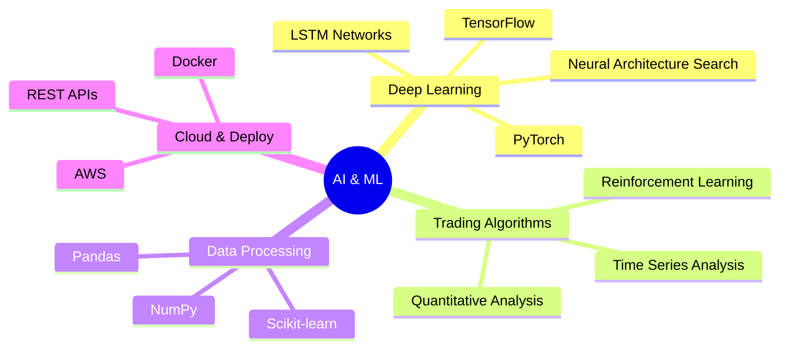

<div align="center">

<!-- ANIMATED HEADER -->
[](https://git.io/typing-svg)

<!-- PROFILE VIEWS & SOCIAL BADGES -->
<div align="center">
  
  <a href="https://www.linkedin.com/in/mohamad-kanso/"></a>
  <a href="https://twitter.com/MoAliKanso"></a>
</div>

<!-- ML TECH STACK -->
## 🧠 Machine Learning Stack


<!-- GITHUB STATS WITH ML EMPHASIS -->
<p align="center">


</p>

<!-- ML PROJECTS SHOWCASE -->
## 🤖 Machine Learning Projects

<details>
<summary><b>🔥 Bitcoin Trading Bot</b></summary>

### LSTM-based Cryptocurrency Trading System
- Architecture: Bidirectional LSTM with attention mechanism
- Performance: 25.77% profit in backtesting
- Features:
  - Real-time market data processing
  - Custom technical indicators
  - Adaptive position sizing
  - Risk management system

```python
# Sample Architecture
class TradingLSTM(nn.Module):
    def __init__(self, input_dim, hidden_dim, n_layers):
        super(TradingLSTM, self).__init__()
        self.hidden_dim = hidden_dim
        self.n_layers = n_layers
        self.lstm = nn.LSTM(
            input_dim, hidden_dim, n_layers, 
            batch_first=True, bidirectional=True
        )
        self.fc = nn.Linear(hidden_dim * 2, 1)
        
    def forward(self, x):
        lstm_out, _ = self.lstm(x)
        predictions = self.fc(lstm_out[:, -1, :])
        return predictions
```

📊 Performance Metrics:
- Win Rate: 61%
- Risk-Reward Ratio: 3.62
- Sharpe Ratio: 2.1
- Maximum Drawdown: 12.3%
</details>

<details>
<summary><b>🧪 Autonomous AI Research Platform</b></summary>

### Neural Architecture Search System
- Implemented reinforcement learning for architecture optimization
- Automated hyperparameter tuning
- Achieved 20% performance improvement

```python
class NASController(nn.Module):
    def __init__(self, num_layers, num_operations):
        super().__init__()
        self.lstm = nn.LSTM(input_size=num_operations,
                           hidden_size=100,
                           num_layers=2)
        self.linear = nn.Linear(100, num_operations)
        
    def sample_architecture(self):
        # Architecture sampling logic
        arch = []
        hidden = None
        input_tensor = torch.zeros(1, 1, self.num_operations)
        
        for _ in range(self.num_layers):
            output, hidden = self.lstm(input_tensor, hidden)
            logits = self.linear(output)
            probs = F.softmax(logits, dim=-1)
            arch.append(torch.multinomial(probs, 1).item())
        
        return arch
```
</details>

<!-- TECHNICAL EXPERTISE -->
## 💻 Technical Expertise

<table>
<tr>
<td width="50%">

### Machine Learning
```python
expertise = {
    'Deep Learning': ['TensorFlow', 'PyTorch', 'Keras'],
    'ML Algorithms': ['LSTM', 'CNN', 'Transformers'],
    'Optimization': ['Adam', 'RMSprop', 'SGD'],
    'Validation': ['Cross-Val', 'Backtesting']
}
```

</td>
<td width="50%">

### Trading Systems
```python
trading_stack = {
    'Analysis': ['Technical', 'Fundamental', 'Sentiment'],
    'Execution': ['Binance API', 'MetaTrader', 'REST'],
    'Risk Mgmt': ['Position Sizing', 'Stop-Loss'],
    'Backtesting': ['Vectorized', 'Event-Driven']
}
```

</td>
</tr>
</table>

<!-- SKILLS VISUALIZATION -->
<div align="center">
  
</div>

<!-- ML METRICS -->
## 📊 Trading Performance

<div align="center">
  <table>
    <tr>
      <td align="center">
        
      </td>
      <td align="center">
        
      </td>
      <td align="center">
        
      </td>
    </tr>
  </table>
</div>

<!-- RECENT ML PUBLICATIONS -->
## 📚 Recent Work
- 🎓 MSc Dissertation: "Deep Learning in Algorithmic Trading"
- 🏆 Computer Vision Challenge Winner (2023)
- 💡 Research: Neural Architecture Search in Trading Systems

<!-- FOOTER -->

</div>
