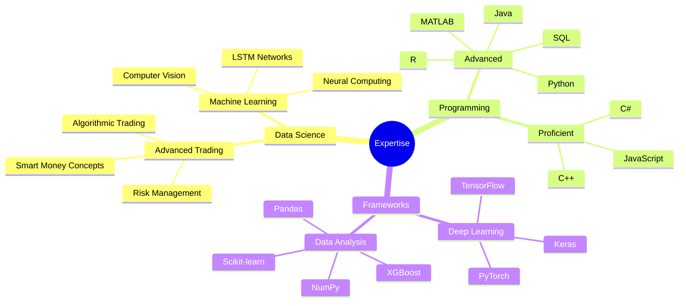

<div align="center">

<!-- ANIMATED HEADER -->
[](https://git.io/typing-svg)

<!-- PROFILE VIEWS & SOCIAL BADGES -->
<div align="center">
  
  <a href="https://www.linkedin.com/in/mohamad-kanso/"></a>
  <a href="mailto:mohamadghorikanso@gmail.com"></a>
</div>

<!-- ML EXPERTISE MINDMAP -->


<!-- GITHUB STATS -->
<p align="center">


</p>

## 💼 Professional Experience

<table>
<tr>
<td>


- 61% Win Rate on $10,000 Live Account
- 3.62 Risk-Reward Ratio
- 700+ Live Trades Analyzed
- 1,500+ Backtested Trades
</td>
<td>


- Mentored 50+ Students
- 60% Conversion Rate
- Python & Unreal Engine
- Database Management
</td>
</tr>
</table>

## 🚀 Featured Projects

<details>
<summary><b>📈 Bitcoin Trading Bot (First Class Grade)</b></summary>

### LSTM-based Cryptocurrency Trading System
- 25.77% Profit in Backtesting
- 665 Trades Executed with 6.2% ROI
- Binance API Integration
- Outperformed Linear Regression Models

Key Features:
```python
# Bidirectional LSTM Architecture
class BitcoinTradingModel:
    def __init__(self):
        self.features = [
            "Technical Indicators",
            "Market Data",
            "Volatility Metrics"
        ]
        self.architecture = {
            "type": "Bidirectional LSTM",
            "layers": "Multiple",
            "regularization": "Dropout",
            "optimizer": "Adam"
        }
        self.performance = {
            "profit": "25.77%",
            "roi": "6.2%",
            "trades": 665
        }
```
</details>

<details>
<summary><b>🤖 Autonomous AI Research Platform</b></summary>

### Advanced ML Architecture
- 20% Performance Improvement
- Reinforcement Learning Integration
- Neural Architecture Search
- PyTorch & Ray Implementation
</details>

<details>
<summary><b>💹 Predictious Trading Bot</b></summary>

### Quantitative Trading System
- Black-Scholes Option Pricing
- 16.4% Trade Success Improvement
- Live Data Scraping
- Advanced Volatility Analysis
</details>

## 🛠️ Technical Stack

<div align="center">
  
</div>

### Advanced Proficiency


## 🏆 Achievements

- 🎓 MSc Data Science (2:1) - City, University of London
- 🥇 UKMT Senior Mathematical Challenge - Top 10% (2020)
- 🏆 Computer Vision Creation Challenge Winner (2023)
- 💹 True Forex Funds Certified Trader

## 📫 Let's Connect!

<div align="center">
  <i>Open to collaborating on innovative fintech and AI projects!</i>
  <br><br>
  <a href="mailto:mohamadghorikanso@gmail.com">
    
  </a>
  <a href="https://www.linkedin.com/in/mohamad-kanso/">
    
  </a>
</div>

<!-- FOOTER -->

</div>
