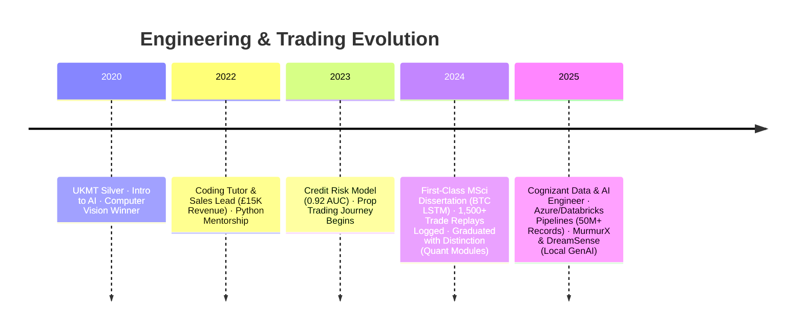
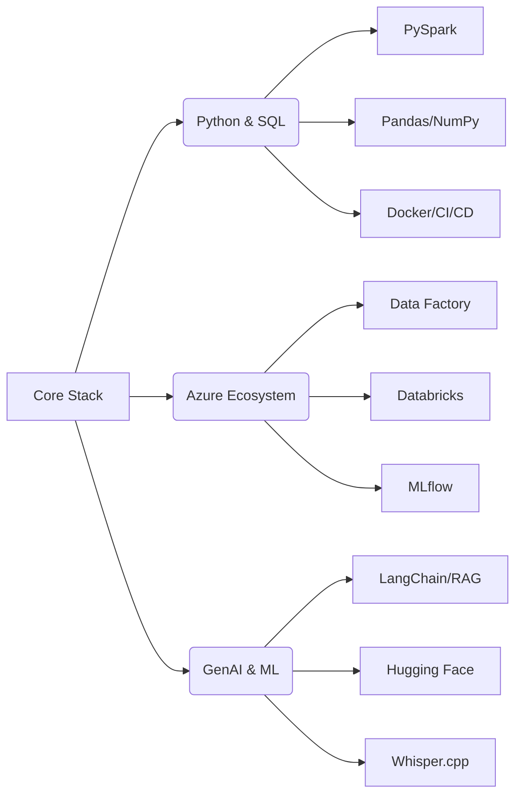
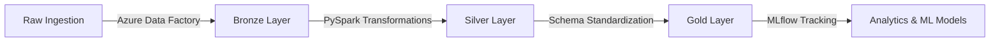

<div align="center">
  
[](https://git.io/typing-svg)

<div align="center">
  <a href="https://www.linkedin.com/in/mohamadkanso/">
    
  </a>
  <a href="mailto:mohamadghorikanso@gmail.com">
    
  </a>
  <a href="https://github.com/MohamadKanso">
    
  </a>
</div>


```mermaid
timeline
    title Engineering & Trading Evolution
    2020 : UKMT Silver · Intro to AI · Computer Vision Winner
    2022 : Coding Tutor & Sales Lead (£15K Revenue) · Python Mentorship
    2023 : Credit Risk Model (0.92 AUC) · Prop Trading Journey Begins
    2024 : First-Class MSci Dissertation (BTC LSTM) · 1,500+ Trade Replays Logged · Graduated with Distinction (Quant Modules)
    2025 : Cognizant Data & AI Engineer · Azure/Databricks Pipelines (50M+ Records) · MurmurX & DreamSense (Local GenAI)

```

## 🔥 Core Competencies

<table>
<tr>
<td width="33%">
<h3 align="center">☁️ Data & AI Engineering</h3>
<p align="center">


<em>Azure Data Factory & Databricks</em>


<em>PySpark Optimization</em>
</p>
</td>
<td width="33%">
<h3 align="center">🧠 Generative AI</h3>
<p align="center">


<em>Local-First LLM Pipelines</em>


<em>RAG & Vector DBs</em>
</p>
</td>
<td width="33%">
<h3 align="center">📈 Systematic Trading</h3>
<p align="center">


<em>Funded Trader Experience</em>


<em>Structure & Liquidity Models</em>
</p>
</td>
</tr>
</table>

## 💼 Technical Arsenal


```mermaid
graph LR
    A[Core Stack] --> B(Python & SQL)
    A --> C(Azure Ecosystem)
    A --> D(GenAI & ML)
    
    B --> B1[PySpark]
    B --> B2[Pandas/NumPy]
    B --> B3[Docker/CI/CD]
    
    C --> C1[Data Factory]
    C --> C2[Databricks]
    C --> C3[MLflow]
    
    D --> D1[LangChain/RAG]
    D --> D2[Hugging Face]
    D --> D3[Whisper.cpp]

```

## 🏆 Signature Projects

<details open>
<summary><b>🤖 MurmurX: Local Voice-Based AI System</b> (2025)</summary>


<div align="center">

| Metric | Achievement |
| --- | --- |
| **Architecture** | Audio Capture → Whisper.cpp → Qwen-2.5 (~3B) → TTS |
| **Performance** | **Sub-2s** End-to-End Latency (Local Hardware) |
| **Cost Efficiency** | **80% Reduction** vs. Commercial Cloud APIs |
| **Privacy** | 100% Offline/Local Execution |

> *Designed a fully local, privacy-first AI pipeline optimizing for hardware constraints. Eliminated reliance on paid APIs while maintaining real-time interaction capabilities.*

</div>
</details>

<details>
<summary><b>📊 Bitcoin LSTM Trading System</b> (First-Class Dissertation)</summary>


<div align="center">

**Result:** First-Class Honours (76%) | **Model:** 227K Parameter LSTM

```python
# Regime-Aware Validation Strategy
class WalkForwardValidator:
    def purge_overlap(self, train_idx, test_idx):
        """Prevents look-ahead bias in time-series data"""
        return train_idx[:-self.embargo], test_idx

```

*Evaluated against linear/naïve baselines using risk-adjusted metrics (Sharpe, Sortino) and realistic transaction costs (0.1%).*

</div>
</details>

<details>
<summary><b>🏭 Enterprise Data Pipelines @ Cognizant</b></summary>


<div align="center">


```mermaid
flowchart LR
    A[Raw Ingestion] -->|Azure Data Factory| B[Bronze Layer]
    B -->|PySpark Transformations| C[Silver Layer]
    C -->|Schema Standardization| D[Gold Layer]
    D -->|MLflow Tracking| E[Analytics & ML Models]

```

**Impact:** Processing **50M+ records daily** for public sector analytics (HMRC/Housing). Reduced downstream modelling latency by **~40%**.

</div>
</details>

## 🛠️ Technologies

<div align="center">

</div>

```python
class Specialist(Engineer, Trader):
    def __init__(self):
        self.stack = {
            "Cloud_Data": ["Azure Data Factory", "Databricks", "PySpark", "MLflow"],
            "GenAI": ["LangChain", "RAG", "Vector DBs", "Whisper", "Hugging Face"],
            "Quant": ["Time-Series Analysis", "Risk Mgmt", "Backtesting", "Smart Money Concepts"],
            "DevOps": ["Docker", "CI/CD", "Git"]
        }

```

## 📜 Awards & Certifications

<table>
<tr>
<td align="center">


GenAI Winner/Participant
</td>
<td align="center">


City, University of London
</td>
<td align="center">


Risk Disciplined
</td>
</tr>
</table>

<div align="center">

</div>
