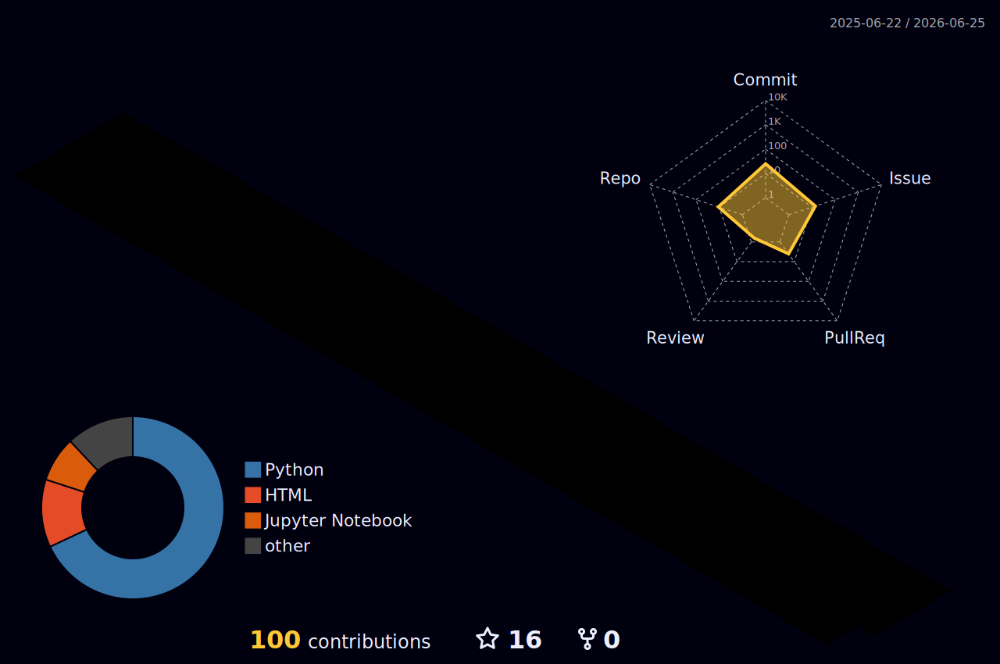

<!-- ════════════════════════════════════════════════════════════════════════ -->
<!--                     MOHAMAD KANSO  ·  GITHUB PROFILE                   -->
<!-- ════════════════════════════════════════════════════════════════════════ -->

<!-- ░░░ VENOM HEADER — animated deep-space gradient ░░░ -->
<div align="center">
  
</div>

<!-- ░░░ DEEP-SPACE ORBIT ANIMATION ░░░ -->
<div align="center">
  
</div>

<!-- ░░░ TYPING SVG ░░░ -->
<div align="center">
  
</div>

<br/>

<!-- ░░░ CONTACT BADGES ░░░ -->
<div align="center">

[](https://linkedin.com/in/mohamadkanso)
&nbsp;
[](mailto:kanso1245@gmail.com)
&nbsp;
[](https://github.com/MohamadKanso)
&nbsp;


</div>

<br/>

<br/>

<!-- ════════════════════════════════════════════════════════════════
     §1  CODE BIO — Python class (rare, shows personality + depth)
     ════════════════════════════════════════════════════════════════ -->

<div align="center">

### 🌌 &nbsp; Navigating the AI Frontier

</div>

```python
class MohamadKanso:
    """Python & GenAI Engineer | LLM Applications · RAG Systems · AI Automation"""

    role     = "Python & GenAI Engineer"
    company  = "Cognizant  —  AI & Analytics Graduate"
    location = "London, UK  🇬🇧"
    degree   = "MSci Data Science  —  City, University of London  (2:1)"

    stack = {
        "genai_llms"  : ["LangChain", "RAG", "FAISS", "ChromaDB", "Ollama", "Whisper.cpp"],
        "ai_ml"       : ["PyTorch", "scikit-learn", "XGBoost", "LightGBM", "MLflow"],
        "data_cloud"  : ["PySpark", "Databricks", "Azure Data Factory", "PostgreSQL"],
        "backend"     : ["Python", "Flask", "Docker", "GitHub Actions", "pytest"],
        "local_ai"    : ["Llama 3.2", "Qwen-2.5 3B", "sub-2s latency", "zero cloud"],
    }

    achievements = [
        "40 % latency reduction across 50 M-record Databricks pipelines",
        "80 % cost reduction via fully local LLM stack vs paid APIs",
        "First-Class dissertation (76 %)  —  BTC/USD time-series LSTM",
        "Computer Vision Challenge Winner  ·  Cognizant Vibe Challenge Winner",
    ]

    def current_mission(self) -> str:
        return "Building enterprise RAG systems & LLM-backed automation @ Cognizant 🚀"
```

<br/>

<div align="center">


&nbsp;

&nbsp;


</div>

<br/>

<br/>

<!-- ════════════════════════════════════════════════════════════════
     §2  TECH ARSENAL
     ════════════════════════════════════════════════════════════════ -->

## 🛸 &nbsp; Tech Arsenal

<div align="center">

**Languages**


<br/><br/>

**AI · GenAI · LLMs**


<br/>


<br/><br/>

**Data Engineering · Cloud**


<br/>


<br/><br/>

**Dev & Frontend**


<br/>


</div>

<br/>

<br/>

<!-- ════════════════════════════════════════════════════════════════
     §3  FEATURED PROJECTS
     ════════════════════════════════════════════════════════════════ -->

## 🌠 &nbsp; Mission Log — Featured Projects

<div align="center">
<table>

<!-- ── Row 1 ── -->
<tr>
<td width="50%" valign="top">
<div align="center">

### 🔒 VoiceSafeKit


**Privacy & safety layer for voice assistants.**<br/>
Classifies transcripts as `SAFE / REDACT / REVIEW / BLOCK` before LLM ingestion. Browser mic → Whisper.cpp in-browser transcription → PII detection (emails, card numbers, addresses) → redacted output. Python CLI, pytest coverage, live demo.

<br/>

[](https://github.com/MohamadKanso/VoiceSafeKit)

</div>
</td>
<td width="50%" valign="top">
<div align="center">

### 🤖 CodeSentry


**Local AI code-review & auto-fix platform.**<br/>
Full codebase scan for bugs & security issues. Caches unchanged files for instant re-runs. Zero cloud dependency. Git-aware: staged reviews, commit-level analysis, pre-commit hooks, patch-based auto-fix, Markdown reports, GitHub Actions CI.

<br/>

[](https://github.com/MohamadKanso/CodeSentry)

</div>
</td>
</tr>

<!-- ── Row 2 ── -->
<tr>
<td width="50%" valign="top">
<div align="center">

### 🎙️ MurmurX


**Fully local voice-first AI pipeline.**<br/>
WebRTC VAD → PyAudio 16 kHz PCM → ffmpeg → Whisper.cpp → Qwen-2.5 3B → TTS. Sub-2s end-to-end on M1 Pro. Inspired by Sesame's CSM. No cloud, no APIs, no cost. Modular, privacy-first, production-grade architecture.

<br/>

[](https://github.com/MohamadKanso/MurmurX)

</div>
</td>
<td width="50%" valign="top">
<div align="center">

### 🎭 DreamSense


**Multi-modal GenAI application.**<br/>
Led end-to-end build in 9-person Cognizant grad team. Orchestrated **Zephyr-7B** (reasoning) + **Stable Diffusion** (image gen) + **Google TTS** (audio) into a single orchestration layer with downloadable outputs. Won Cognizant Vibe Coding Challenge 2025.

<br/>

[](https://github.com/MohamadKanso/DreamSense)

</div>
</td>
</tr>

<!-- ── Row 3 ── -->
<tr>
<td width="50%" valign="top">
<div align="center">

### ⚡ IncidentForge


**Synthetic production incidents for AI SRE agents.**<br/>
Generates realistic production incidents + root-cause analysis scenarios for benchmarking LLM-driven site-reliability engineering agents under operational pressure. Structured for rigorous, reproducible evaluation.

<br/>

[](https://github.com/MohamadKanso/IncidentForge)

</div>
</td>
<td width="50%" valign="top">
<div align="center">

### 📈 BTC Time-Series ML System


**MSci Dissertation — First-Class mark (76%).**<br/>
LSTM + regression models on intraday BTC/USD data with walk-forward validation and technical indicator engineering. Strict anti-lookahead protocols, regime-aware feature engineering. Evaluated against linear baselines across rolling windows.

<br/>

[](https://github.com/MohamadKanso/Dissertation)

</div>
</td>
</tr>

<!-- ── Row 4 ── -->
<tr>
<td width="50%" valign="top">
<div align="center">

### ⚙️ WorkflowForge


**Workflow intelligence engine.**<br/>
Transforms messy operational context into structured, repeatable execution systems. Bridges the gap between unstructured operational knowledge and reliable automated workflows. Open-source.

<br/>

[](https://github.com/MohamadKanso/WorkflowForge)

</div>
</td>
<td width="50%" valign="top">
<div align="center">

### 📊 Trading ML Research


**Quantitative finance & ML research library.**<br/>
Python analytics framework for sequential decision-making simulations: 700+ recorded runs under 5% max drawdown, 1,500+ replayed time-series samples with structured tagging and statistical analysis to identify repeatable error patterns.

<br/>

[](https://github.com/MohamadKanso/trading-ml-research)

</div>
</td>
</tr>

</table>
</div>

<br/>

<br/>

<!-- ════════════════════════════════════════════════════════════════
     §4  STATS  —  profile summary cards + trio + activity graph
     ════════════════════════════════════════════════════════════════ -->

## 📡 &nbsp; Deep Space Telemetry

<!-- GitHub Profile Summary Cards – full row then 4-card row -->
<div align="center">
  
</div>
<div align="center">
  <!--
  --><!--
  --><!--
  -->
</div>

<br/>

<!-- Classic stats trio -->
<div align="center">
  
  &nbsp;
  
</div>

<div align="center">
  
</div>

<br/>

<!-- Activity graph -->
<div align="center">
  
</div>

<br/>

<!-- Trophies -->
<div align="center">
  
</div>

<br/>

<br/>

<!-- ════════════════════════════════════════════════════════════════
     §5  3-D CONTRIBUTION CALENDAR  (generated by GitHub Action)
     ════════════════════════════════════════════════════════════════ -->

## 🪐 &nbsp; 3D Contribution Calendar

<div align="center">
  
</div>

<br/>

<br/>

<!-- ════════════════════════════════════════════════════════════════
     §6  ACHIEVEMENTS TABLE
     ════════════════════════════════════════════════════════════════ -->

## 🏆 &nbsp; Orbit Log — Achievements

<div align="center">

| 🥇 Achievement | 📅 Year | 🔭 Context |
|:---|:---:|:---|
| **Computer Vision Challenge Winner** | 2023 | City, University of London — ranked #1 |
| **Cognizant Vibe Coding Challenge** | 2025 | Led 9-person graduate team — DreamSense |
| **First-Class Dissertation** | 2024 | Time-Series ML on BTC/USD — 76% mark |
| **UKMT Senior Maths Challenge Silver** | 2020 | National Mathematics Competition |

</div>

<br/>

<br/>

<!-- ════════════════════════════════════════════════════════════════
     §7  CONTRIBUTION SNAKE  (generated by GitHub Action → output branch)
     ════════════════════════════════════════════════════════════════ -->

## 🌀 &nbsp; Contribution Constellation

<div align="center">
  <picture>
    <source media="(prefers-color-scheme: dark)"
            srcset="https://raw.githubusercontent.com/MohamadKanso/MohamadKanso/output/snake-dark.svg"/>
    <source media="(prefers-color-scheme: light)"
            srcset="https://raw.githubusercontent.com/MohamadKanso/MohamadKanso/output/snake.svg"/>
    
  </picture>
</div>

<br/>

<!-- ░░░ VENOM FOOTER ░░░ -->
<div align="center">
  
</div>

<div align="center">
  <i>✦ &nbsp; "The cosmos is within us. We are made of star-stuff." &nbsp;—&nbsp; Carl Sagan &nbsp; ✦</i>
</div>
