<div align="center">
  
[](https://git.io/typing-svg)


<div align="center">
  <a href="https://www.linkedin.com/in/mohamadkanso/">
    
  </a>
  <a href="mailto:mohamadghorikanso@gmail.com">
    
  </a>
  <a href="[YOUR_GITHUB_LINK]">
    
  </a>
</div>



```mermaid
timeline
    title ML Trading Journey
    2020 : UKMT Top 10% · Introduction to AI · Mathematics for Computing · Java Programming · Computer Vision Challenge (Winner)  
    2021 : Business Analytics Internship @ Pivos · Advanced Data Structures and Algorithms · Computer Networks · Language Processors  
    2022 : Portfolio Optimisation Model (+12% Risk-Adjusted Returns) · MATLAB & R-based Asset Allocation  
    2023 : Cognitive Computation · Programming for AI · Computer Vision · Extensive Machine Learning · 0.92 AUC Credit Risk Model · Prop Trading (True Forex Funds - $10K Funded Account)  
    2024 : First-Class Bitcoin LSTM Trading Bot (6.2% ROI on Backtests) · Dissertation (227K-Param LSTM Model) · Advanced Machine Learning · Big Data · Neural Computing · Advanced Visual Analytics · Smart Money Concepts, 700+ Trades Analyzed (Prop Firm)  



```

## 🔥 Core Competencies

<table>
  <tr>
    <td width="33%">
      <h3 align="center">📈 Trading Systems</h3>
      <p align="center">
        
        
        <br>
        <em>700+ Live Trades Analyzed</em><br>
        <em>1.5K Backtests Executed</em>
      </p>
    </td>
    <td width="33%">
      <h3 align="center">🤖 Deep Learning</h3>
      <p align="center">
        
        
        <br>
        <em>227K LSTM Parameters</em><br>
        <em>15-Min Interval Trading</em>
      </p>
    </td>
    <td width="33%">
      <h3 align="center">🚀 Production ML</h3>
      <p align="center">
        
        
        <br>
        <em>Binance API Integration</em><br>
        <em>Cloud Deployment</em>
      </p>
    </td>
  </tr>
</table>

## 💼 Professional Arsenal


## 🏆 Signature Projects

<details>
<summary>📊 Bitcoin Trading Bot (First-Class Dissertation)</summary>

<div align="center">
  
| Metric              | LSTM Model       | Baseline       |
|---------------------|------------------|----------------|
| R² Accuracy         | 99.53%           | 94.12%         |
| ROI                 | 6.2%             | 25.77%         |
| Trades Executed     | 665              | 412            |
| Volatility Handling | Excellent        | Moderate       |

**Architecture Breakdown**
```python
class BitcoinLSTM(nn.Module):
    def __init__(self):
        super(BitcoinLSTM, self).__init__()
        self.lstm = nn.LSTM(input_size=10, hidden_size=64, 
                          num_layers=2, bidirectional=True)
        self.dropout = nn.Dropout(0.3)
        self.linear = nn.Linear(128, 1)
    
    def forward(self, x):
        x, _ = self.lstm(x)
        x = self.dropout(x)
        return self.linear(x[:, -1])
```

**Live Trading Performance**

</div>
</details>

<details>
<summary>📉 Prop Trading Dashboard</summary>

<div align="center">
  
**Key Metrics Tracked**


**Smart Money Concepts Applied**
- Liquidity Tracking
- Order Flow Analysis
- Market Structure Breakouts
- Institutional Footprints
</div>
</details>

## 🛠️ Technical Mastery

<div align="center>
  
</div>

**Quantitative Stack**
```python
quant_stack = {
    "Core": ["Python", "TensorFlow", "PyTorch"],
    "Analysis": ["Pandas", "NumPy", "Tableau"],
    "Trading": ["Binance API", "OANDA", "MetaTrader"],
    "Optimization": ["XGBoost", "LightGBM", "Optuna"],
    "Infrastructure": ["Docker", "AWS", "Git"]
}
```

## 📜 Certifications & Awards

<table>
  <tr>
    <td align="center">
      
      <br>Prop Trading Certification
    </td>
    <td align="center">
      
      <br>Mathematical Excellence
    </td>
    <td align="center">
      
      <br>Computer Vision
    </td>
  </tr>
</table>

<div align="center">
  
</div>
```
