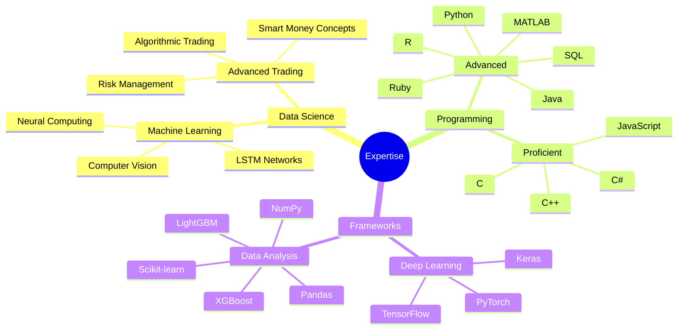

  
  
  

## 💼 Professional Experience

<table>
<tr>
<td>

- 61% Win Rate on $10,000 Live Account
- 3.62 Risk-Reward Ratio
- 700+ Live Trades Analyzed
- 1,500+ Backtested Trades
</td>
<td>

- Mentored 50+ Students
- 60% Conversion Rate
- Python & Unreal Engine
- Database Management
</td>
</tr>
<tr>
<td colspan="2">

- Analyzed 50,000+ records using Python & Tableau
- Led team of 4 analysts in dashboard creation
- Reduced report generation time by 60%
- Improved cross-department collaboration
</td>
</tr>
</table>

## 🚀 Featured Projects

 📈 Bitcoin Trading Bot (First Class Grade)

### LSTM-based Cryptocurrency Trading System

- 25.77% Profit in Backtesting
- 665 Trades Executed with 6.2% ROI
- Binance API Integration
- Outperformed Linear Regression Models
- 99.53% R² Prediction Accuracy

Key Features:

**Features:**
- Technical Indicators
- Market Data
- Volatility Metrics

**Architecture:**
- Type: Bidirectional LSTM
- Layers: Multiple
- Regularization: Dropout (0.3)
- Optimizer: Adam (lr=0.0005)
- Parameters: 227,745

**Performance:**
- Profit: 25.77%
- ROI: 6.2%
- Trades: 665

 🤖 Autonomous AI Research Platform

### Advanced ML Architecture
- 20% Performance Improvement
- Reinforcement Learning Integration
- Neural Architecture Search
- PyTorch & Ray Implementation

 💹 Predictious Trading Bot

### Quantitative Trading System
- Black-Scholes Option Pricing
- 16.4% Trade Success Improvement
- Live Data Scraping
- Advanced Volatility Analysis

 💳 Credit Risk Prediction Model

### ML-Based Risk Assessment
- 0.92 AUC Score
- Real-time Scoring System
- Cloud Platform Deployment
- Integrated with Risk Teams

 📊 Portfolio Optimisation Model

### Advanced Portfolio Management
- Multi-asset Optimization
- Sharpe Ratio Analysis
- Mean-variance Optimization
- 12% Improvement in Risk-adjusted Returns

## 🛠️ Technical Stack

  

### Advanced Proficiency

## 🌐 Languages

## 🏆 Achievements

- 🎓 MSc Data Science (2:1) - City, University of London
- 🥇 UKMT Senior Mathematical Challenge - Top 10% (2020)
- 🏆 Computer Vision Creation Challenge Winner (2023)
- 💹 True Forex Funds Certified Trader

## 📫 Let's Connect!

  <i>Open to collaborating on innovative fintech and AI projects!</i>
    
  
  

